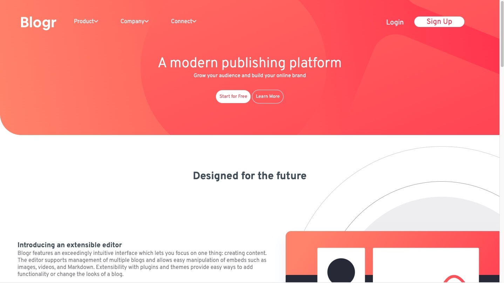

## Table of contents

- [Overview](#overview)
  - [The challenge](#the-challenge)
  - [Screenshot](#screenshot)
  - [Links](#links)
- [My process](#my-process)
  - [Built with](#built-with)
  - [Continued development](#continued-development)
- [Author](#author)

## Overview
My attempt at recreating this nft preview 
card to brush up on my HTML and CSS.

### The challenge
- View the optimal layout depending on their device's screen size
- See hover states for interactive elements

### Screenshot

### Links

- Solution URL: (https://github.com/Chidu97/blogr-landing-page)
- Live Site URL: [Add live site URL here](https://your-live-site-url.com)

## My process

- I started by studying the design in the desktop-design template to give me an idea of how to structure.

- I've structured the code in a way that i can understand how i want to design and begin the design of the code.

- After I've added a few styles and referred to the work on the browser. I start tweaking the styles to better match the final design 

### Built with

- Semantic HTML5 markup
- CSS custom properties
- Flexbox
- Pseudo selectors

### Continued development

After completing this project I'e realised there's so much that i still don't know in HTML, CSS and especially JavaScript. So continuing to do challenges like this, adding the final solution to Github and then deploying it, will only help me deepen my knowledge of programming.

## Author

- Frontend Mentor - [@Chidu97](https://www.frontendmentor.io/profile/Chidu97)
- Twitter - [@chidu_dev](https://twitter.com/chidu_dev)